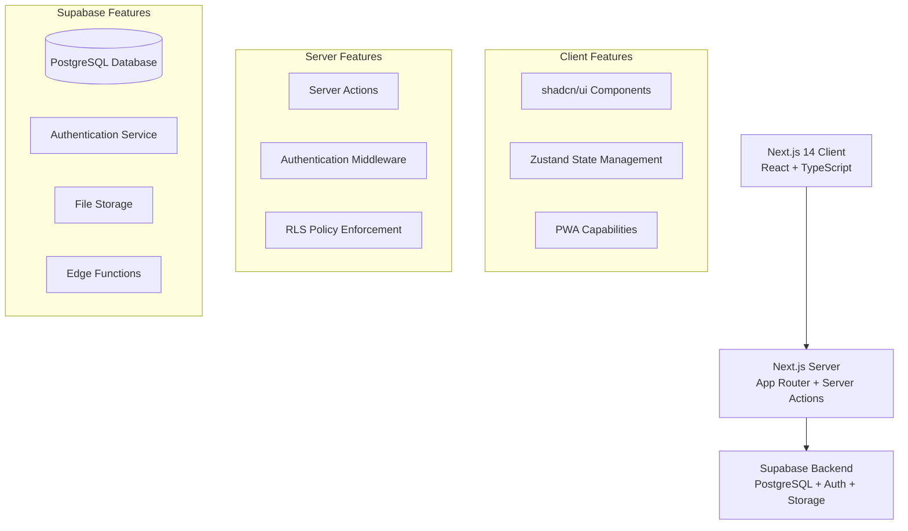

# Design Document

## Overview

LinguaFlow - это современное веб-приложение для изучения языков, построенное на архитектуре Next.js 14 с App Router и Supabase в качестве бэкенда. Приложение использует прогрессивный подход к обучению через интерактивные слайдовые уроки, систему интервального повторения (SRS) для карточек и геймификацию для мотивации пользователей.

## Architecture

### High-Level Architecture



### Technology Stack

- **Frontend**: Next.js 14 (App Router), React 18, TypeScript
- **Styling**: Tailwind CSS, shadcn/ui components
- **State Management**: Zustand для клиентского состояния
- **Backend**: Supabase (PostgreSQL, Authentication, Storage, Edge Functions)
- **Deployment**: Vercel (frontend), Supabase (backend)
- **Package Manager**: pnpm

## Components and Interfaces

### Core Components Architecture

```mermaid
graph TD
    App[App Layout]
    
    App --> Auth[Authentication Pages]
    App --> Dashboard[User Dashboard]
    App --> Lessons[Lesson System]
    App --> Flashcards[Flashcard System]
    App --> Profile[User Profile]
    App --> Admin[Admin Panel]
    
    Auth --> Login[Login Form]
    Auth --> Register[Registration Form]
    Auth --> Reset[Password Reset]
    
    Dashboard --> Progress[Progress Overview]
    Dashboard --> Achievements[Achievement Gallery]
    Dashboard --> Stats[Statistics Charts]
    
    Lessons --> LessonPlayer[Lesson Player]
    Lessons --> SlideRenderer[Slide Renderer]
    Lessons --> Navigation[Lesson Navigation]
    
    Flashcards --> StudyMode[Study Mode]
    Flashcards --> TestMode[Test Mode]
    Flashcards --> SRSEngine[SRS Algorithm Engine]
    
    Admin --> ContentEditor[Content Editor]
    Admin --> UserManagement[User Management]
    Admin --> Analytics[Analytics Dashboard]
```



### Component Interfaces

#### Lesson System Components

```typescript
interface LessonPlayerProps {
  lessonId: string;
  onComplete: (progress: LessonProgress) => void;
  onExit: (progress: LessonProgress) => void;
}

interface SlideRendererProps {
  slide: Slide;
  onAnswer: (answer: SlideAnswer) => void;
  showFeedback: boolean;
}

interface Slide {
  id: string;
  type: 'theory' | 'quiz_single' | 'quiz_multiple' | 'fill_gap' | 'match';
  content: SlideContent;
  feedback?: string;
}
```

#### Flashcard System Components

```typescript
interface FlashcardStudyProps {
  cardSet: FlashcardSet;
  onRating: (cardId: string, rating: SRSRating) => void;
  onComplete: (results: StudyResults) => void;
}

interface SRSEngine {
  calculateNextReview(card: Flashcard, rating: SRSRating): Date;
  getDueCards(userId: string): Promise<Flashcard[]>;
  updateCardProgress(cardId: string, rating: SRSRating): Promise<void>;
}
```

#### Authentication & Authorization

```typescript
interface AuthContext {
  user: User | null;
  signIn: (email: string, password: string) => Promise<void>;
  signUp: (email: string, password: string) => Promise<void>;
  signOut: () => Promise<void>;
  resetPassword: (email: string) => Promise<void>;
}

interface User {
  id: string;
  email: string;
  name?: string;
  avatar?: string;
  role: 'user' | 'admin';
  level: number;
  xp: number;
}
```

## Data Models

### Database Schema

```sql
-- Users table (managed by Supabase Auth)
CREATE TABLE profiles (
  id UUID REFERENCES auth.users PRIMARY KEY,
  email TEXT NOT NULL,
  name TEXT,
  avatar_url TEXT,
  role TEXT DEFAULT 'user' CHECK (role IN ('user', 'admin')),
  xp INTEGER DEFAULT 0,
  level INTEGER DEFAULT 1,
  created_at TIMESTAMP WITH TIME ZONE DEFAULT NOW(),
  updated_at TIMESTAMP WITH TIME ZONE DEFAULT NOW()
);

-- Languages
CREATE TABLE languages (
  id UUID PRIMARY KEY DEFAULT gen_random_uuid(),
  code TEXT UNIQUE NOT NULL, -- 'en', 'de'
  name TEXT NOT NULL, -- 'English', 'German'
  flag_url TEXT,
  created_at TIMESTAMP WITH TIME ZONE DEFAULT NOW()
);

-- Courses (A1, A2, B1, B2, etc.)
CREATE TABLE courses (
  id UUID PRIMARY KEY DEFAULT gen_random_uuid(),
  language_id UUID REFERENCES languages(id) ON DELETE CASCADE,
  level TEXT NOT NULL, -- 'A1', 'A2', 'B1', 'B2'
  name TEXT NOT NULL,
  description TEXT,
  order_index INTEGER NOT NULL,
  created_at TIMESTAMP WITH TIME ZONE DEFAULT NOW()
);

-- Themes within courses
CREATE TABLE themes (
  id UUID PRIMARY KEY DEFAULT gen_random_uuid(),
  course_id UUID REFERENCES courses(id) ON DELETE CASCADE,
  name TEXT NOT NULL,
  description TEXT,
  order_index INTEGER NOT NULL,
  created_at TIMESTAMP WITH TIME ZONE DEFAULT NOW()
);

-- Lessons within themes
CREATE TABLE lessons (
  id UUID PRIMARY KEY DEFAULT gen_random_uuid(),
  theme_id UUID REFERENCES themes(id) ON DELETE CASCADE,
  name TEXT NOT NULL,
  description TEXT,
  slides JSONB NOT NULL, -- Array of slide objects
  order_index INTEGER NOT NULL,
  estimated_duration INTEGER, -- in minutes
  created_at TIMESTAMP WITH TIME ZONE DEFAULT NOW(),
  updated_at TIMESTAMP WITH TIME ZONE DEFAULT NOW()
);

-- User lesson progress
CREATE TABLE lesson_progress (
  id UUID PRIMARY KEY DEFAULT gen_random_uuid(),
  user_id UUID REFERENCES profiles(id) ON DELETE CASCADE,
  lesson_id UUID REFERENCES lessons(id) ON DELETE CASCADE,
  current_slide INTEGER DEFAULT 0,
  completed BOOLEAN DEFAULT FALSE,
  score DECIMAL(5,2), -- percentage score
  time_spent INTEGER, -- in seconds
  started_at TIMESTAMP WITH TIME ZONE DEFAULT NOW(),
  completed_at TIMESTAMP WITH TIME ZONE,
  UNIQUE(user_id, lesson_id)
);

-- Vocabulary words
CREATE TABLE vocabulary (
  id UUID PRIMARY KEY DEFAULT gen_random_uuid(),
  language_id UUID REFERENCES languages(id) ON DELETE CASCADE,
  word TEXT NOT NULL,
  transcription TEXT,
  translation TEXT NOT NULL,
  part_of_speech TEXT,
  audio_url TEXT,
  example_sentence TEXT,
  created_at TIMESTAMP WITH TIME ZONE DEFAULT NOW()
);

-- Lesson vocabulary associations
CREATE TABLE lesson_vocabulary (
  lesson_id UUID REFERENCES lessons(id) ON DELETE CASCADE,
  vocabulary_id UUID REFERENCES vocabulary(id) ON DELETE CASCADE,
  PRIMARY KEY (lesson_id, vocabulary_id)
);

-- Flashcard sets
CREATE TABLE flashcard_sets (
  id UUID PRIMARY KEY DEFAULT gen_random_uuid(),
  user_id UUID REFERENCES profiles(id) ON DELETE CASCADE,
  name TEXT NOT NULL,
  description TEXT,
  auto_generated BOOLEAN DEFAULT FALSE,
  source_lesson_id UUID REFERENCES lessons(id) ON DELETE SET NULL,
  created_at TIMESTAMP WITH TIME ZONE DEFAULT NOW()
);

-- Individual flashcards
CREATE TABLE flashcards (
  id UUID PRIMARY KEY DEFAULT gen_random_uuid(),
  set_id UUID REFERENCES flashcard_sets(id) ON DELETE CASCADE,
  vocabulary_id UUID REFERENCES vocabulary(id) ON DELETE CASCADE,
  ease_factor DECIMAL(3,2) DEFAULT 2.5, -- SRS ease factor
  interval_days INTEGER DEFAULT 1, -- SRS interval
  repetitions INTEGER DEFAULT 0, -- SRS repetition count
  next_review TIMESTAMP WITH TIME ZONE DEFAULT NOW(),
  created_at TIMESTAMP WITH TIME ZONE DEFAULT NOW(),
  UNIQUE(set_id, vocabulary_id)
);

-- Flashcard review history
CREATE TABLE flashcard_reviews (
  id UUID PRIMARY KEY DEFAULT gen_random_uuid(),
  flashcard_id UUID REFERENCES flashcards(id) ON DELETE CASCADE,
  user_id UUID REFERENCES profiles(id) ON DELETE CASCADE,
  rating INTEGER NOT NULL CHECK (rating IN (1, 2, 3, 4)), -- Again, Hard, Good, Easy
  response_time INTEGER, -- in milliseconds
  reviewed_at TIMESTAMP WITH TIME ZONE DEFAULT NOW()
);

-- Achievement definitions
CREATE TABLE achievements (
  id UUID PRIMARY KEY DEFAULT gen_random_uuid(),
  name TEXT NOT NULL,
  description TEXT NOT NULL,
  icon_url TEXT,
  type TEXT NOT NULL, -- 'streak', 'explorer', 'sprinter', 'consistent'
  condition_data JSONB NOT NULL, -- Achievement trigger conditions
  xp_reward INTEGER DEFAULT 0,
  created_at TIMESTAMP WITH TIME ZONE DEFAULT NOW()
);

-- User achievements
CREATE TABLE user_achievements (
  id UUID PRIMARY KEY DEFAULT gen_random_uuid(),
  user_id UUID REFERENCES profiles(id) ON DELETE CASCADE,
  achievement_id UUID REFERENCES achievements(id) ON DELETE CASCADE,
  earned_at TIMESTAMP WITH TIME ZONE DEFAULT NOW(),
  UNIQUE(user_id, achievement_id)
);

-- User statistics (daily/weekly aggregates)
CREATE TABLE user_statistics (
  id UUID PRIMARY KEY DEFAULT gen_random_uuid(),
  user_id UUID REFERENCES profiles(id) ON DELETE CASCADE,
  date DATE NOT NULL,
  lessons_completed INTEGER DEFAULT 0,
  flashcards_reviewed INTEGER DEFAULT 0,
  time_spent INTEGER DEFAULT 0, -- in seconds
  accuracy_rate DECIMAL(5,2), -- percentage
  xp_earned INTEGER DEFAULT 0,
  UNIQUE(user_id, date)
);
```

### TypeScript Data Models

```typescript
interface Language {
  id: string;
  code: string;
  name: string;
  flagUrl?: string;
}

interface Course {
  id: string;
  languageId: string;
  level: string;
  name: string;
  description?: string;
  orderIndex: number;
}

interface Theme {
  id: string;
  courseId: string;
  name: string;
  description?: string;
  orderIndex: number;
}

interface Lesson {
  id: string;
  themeId: string;
  name: string;
  description?: string;
  slides: Slide[];
  orderIndex: number;
  estimatedDuration?: number;
}

interface Slide {
  id: string;
  type: 'theory' | 'quiz_single' | 'quiz_multiple' | 'fill_gap' | 'match';
  content: SlideContent;
  feedback?: string;
}

interface SlideContent {
  title?: string;
  text?: string;
  image?: string;
  question?: string;
  options?: string[];
  correctAnswers?: number[];
  gaps?: GapItem[];
  matchPairs?: MatchPair[];
}

interface Vocabulary {
  id: string;
  languageId: string;
  word: string;
  transcription?: string;
  translation: string;
  partOfSpeech?: string;
  audioUrl?: string;
  exampleSentence?: string;
}

interface Flashcard {
  id: string;
  setId: string;
  vocabularyId: string;
  vocabulary?: Vocabulary;
  easeFactor: number;
  intervalDays: number;
  repetitions: number;
  nextReview: Date;
}

interface Achievement {
  id: string;
  name: string;
  description: string;
  iconUrl?: string;
  type: 'streak' | 'explorer' | 'sprinter' | 'consistent';
  conditionData: Record<string, any>;
  xpReward: number;
}
```

## Correctness Properties

*A property is a characteristic or behavior that should hold true across all valid executions of a system-essentially, a formal statement about what the system should do. Properties serve as the bridge between human-readable specifications and machine-verifiable correctness guarantees.*

### Authentication and Authorization Properties

Property 1: User Registration Validation
*For any* valid email and password combination, user registration should succeed and create a new account with confirmation email sent
**Validates: Requirements 1.1**

Property 2: Email Format Validation
*For any* invalid email format, the system should reject registration and display appropriate validation error
**Validates: Requirements 1.2**

Property 3: Authentication Success
*For any* valid user credentials, authentication should succeed and redirect to dashboard
**Validates: Requirements 1.3**

Property 4: Authentication Failure Handling
*For any* incorrect credentials, the system should display authentication error without revealing specific failure reason
**Validates: Requirements 1.4**

Property 5: Password Reset Functionality
*For any* registered email address, password reset should send reset link to that email
**Validates: Requirements 1.5**

Property 6: Route Protection
*For any* protected route, unauthorized access attempts should be blocked and redirect to authentication
**Validates: Requirements 1.6**

Property 7: Admin Access Control
*For any* user role, admin panel access should only be granted to users with admin role
**Validates: Requirements 6.1**

### User Profile and Progress Properties

Property 8: Profile Information Display
*For any* user profile, the profile page should display all required information: avatar, name, email, and current level
**Validates: Requirements 2.1**

Property 9: Level Calculation Consistency
*For any* XP amount, user level should be calculated using the formula: Level = sqrt(XP / 100)
**Validates: Requirements 2.2, 5.8**

Property 10: Progress Visualization
*For any* user progress state, the progress panel should accurately reflect completed lessons and learned words
**Validates: Requirements 2.3**

Property 11: Statistics Display Completeness
*For any* user activity data, statistics should show all required metrics: daily/weekly graphs and numbers
**Validates: Requirements 2.4**

Property 12: Achievement Collection Display
*For any* set of earned achievements, the system should display them as visual cards with complete information
**Validates: Requirements 2.5**

Property 13: Password Change Security
*For any* valid new password, password change should validate and update securely
**Validates: Requirements 2.6**

### Lesson System Properties

Property 14: Content Hierarchy Organization
*For any* content structure, the system should organize it as Language -> Course -> Theme -> Lesson hierarchy
**Validates: Requirements 3.1**

Property 15: Lesson Presentation Flow
*For any* lesson structure, slides should be presented in linear sequence with proper navigation controls
**Validates: Requirements 3.2**

Property 16: Slide Rendering Completeness
*For any* slide type (theory, quiz_single, quiz_multiple, fill_gap, match), the system should render all required elements and interactions correctly
**Validates: Requirements 3.3, 3.4, 3.5, 3.6, 3.7**

Property 17: Interactive Feedback Provision
*For any* interactive slide answer, the system should provide instant feedback with explanations
**Validates: Requirements 3.8**

Property 18: Lesson Navigation State
*For any* lesson position, the system should show accurate progress indicator and enable appropriate navigation buttons
**Validates: Requirements 3.9**

Property 19: Progress Persistence Round-trip
*For any* lesson state, saving progress and later loading should preserve the exact lesson state
**Validates: Requirements 3.10**

### Flashcard System Properties

Property 20: Automatic Flashcard Generation
*For any* completed lesson with vocabulary, the system should automatically create flashcard sets from lesson vocabulary
**Validates: Requirements 4.1**

Property 21: Manual Flashcard Creation
*For any* word combination, users should be able to create custom flashcard sets with manual word addition
**Validates: Requirements 4.2**

Property 22: Flashcard Display Completeness
*For any* flashcard, learning mode should display word/phrase in target language with audio playback option when available
**Validates: Requirements 4.3**

Property 23: Flashcard Interaction Behavior
*For any* flashcard flip action, the system should reveal translation and usage examples
**Validates: Requirements 4.4**

Property 24: SRS Rating Acceptance
*For any* valid difficulty rating ("Again", "Hard", "Good", "Easy"), the system should accept and process it for SRS algorithm
**Validates: Requirements 4.5**

Property 25: Test Mode Format Variety
*For any* test configuration, the system should present various formats: word writing by translation, translation selection by word
**Validates: Requirements 4.6**

Property 26: SRS Algorithm Scheduling
*For any* difficulty rating and previous performance combination, SRS algorithm should calculate appropriate next review schedule
**Validates: Requirements 4.7**

### Gamification Properties

Property 27: XP Award Consistency
*For any* lesson completion or flashcard test performance, the system should award XP points proportional to performance
**Validates: Requirements 5.1**

Property 28: Achievement Unlocking Automation
*For any* milestone achievement condition, the system should automatically unlock achievements and display instant notification
**Validates: Requirements 5.2**

Property 29: Achievement Display Completeness
*For any* achievement, the display should show unique card with title, description, icon, and earned date
**Validates: Requirements 5.3**

Property 30: Achievement Tracking Accuracy
*For any* user activity pattern, the system should accurately track all achievement types: Streak, Explorer, Sprinter, and Consistent achievements
**Validates: Requirements 5.4, 5.5, 5.6, 5.7**

### Administrative Properties

Property 31: Content Management CRUD
*For any* content entity (languages, courses, themes, lessons), the system should provide complete CRUD operations
**Validates: Requirements 6.2**

Property 32: Lesson Editor Functionality
*For any* slide combination, the visual editor should allow lesson assembly with live preview
**Validates: Requirements 6.3**

Property 33: Slide Type Support
*For any* slide type, the editor should support editing all slide types: theory, quiz_single, quiz_multiple, fill_gap, match
**Validates: Requirements 6.4**

Property 34: Lesson Preview Capability
*For any* lesson content, admins should be able to preview lessons before publishing
**Validates: Requirements 6.5**

### Vocabulary Management Properties

Property 35: Vocabulary Storage Round-trip
*For any* vocabulary data (word, transcription, translation, part of speech), storing then retrieving should preserve all information
**Validates: Requirements 7.1**

Property 36: Vocabulary-Lesson Association
*For any* word-lesson combination, the system should allow and maintain proper associations
**Validates: Requirements 7.2**

Property 37: Audio File Upload Interface
*For any* valid audio file, the drag-and-drop interface should handle upload successfully
**Validates: Requirements 7.3**

Property 38: Audio File Validation and Association
*For any* valid audio file format, the system should validate and associate it with corresponding vocabulary entries
**Validates: Requirements 7.4**

### Achievement Management Properties

Property 39: Achievement Template Configuration
*For any* achievement template configuration (title, description, icon, trigger conditions), the system should allow complete customization
**Validates: Requirements 8.1**

Property 40: Achievement Type Flexibility
*For any* achievement configuration, the system should support different achievement types with customizable logic and thresholds
**Validates: Requirements 8.2**

Property 41: Automatic Achievement Awarding
*For any* qualifying condition fulfillment, the system should automatically award achievements to qualifying users
**Validates: Requirements 8.3**

### Analytics and Monitoring Properties

Property 42: User Data Anonymization
*For any* user data display in admin panel, the system should properly anonymize information for privacy protection
**Validates: Requirements 9.1**

Property 43: Platform Statistics Accuracy
*For any* time period and data set, platform statistics should accurately display active user count and completed lessons
**Validates: Requirements 9.2**

Property 44: Analytics Dashboard Completeness
*For any* metrics data, the analytics dashboard should display all key performance metrics
**Validates: Requirements 9.3**

### Security and Performance Properties

Property 45: Responsive Design Consistency
*For any* screen size from 320px to 1920px+, the system should provide consistent responsive design
**Validates: Requirements 10.2**

Property 46: Data Access Control
*For any* user and data combination, RLS policies should properly isolate data and control access
**Validates: Requirements 10.4**

Теперь проведу анализ требований для определения тестируемых свойств:

<function_calls>
<invoke name="prework">
<parameter name="featureName">language-learning-platform

## Error Handling

### Authentication Errors
- **Invalid Credentials**: Display generic "Invalid email or password" message to prevent user enumeration
- **Network Errors**: Show retry mechanism with exponential backoff
- **Session Expiry**: Automatically redirect to login with session restoration after re-authentication

### Lesson System Errors
- **Slide Loading Failures**: Display error message with retry option, fallback to cached content if available
- **Progress Save Failures**: Queue progress updates for retry, show warning to user about unsaved progress
- **Navigation Errors**: Prevent navigation to invalid slides, maintain current position on error

### Flashcard System Errors
- **SRS Calculation Errors**: Fall back to default intervals, log errors for admin review
- **Audio Playback Failures**: Show visual indicator when audio unavailable, continue without audio
- **Sync Failures**: Queue updates for retry, show offline indicator

### File Upload Errors
- **Invalid File Format**: Show clear error message with supported formats list
- **File Size Limits**: Display progress and clear size limit information
- **Upload Failures**: Provide retry mechanism with progress indication

### Database Errors
- **Connection Failures**: Implement connection pooling and retry logic
- **RLS Policy Violations**: Log security events, return generic access denied message
- **Data Validation Errors**: Return specific field-level validation messages

### General Error Handling Principles
- **User-Friendly Messages**: All error messages should be clear and actionable
- **Error Logging**: Comprehensive logging for debugging without exposing sensitive information
- **Graceful Degradation**: System should continue functioning with reduced capabilities when possible
- **Recovery Mechanisms**: Provide clear paths for users to recover from error states

## Testing Strategy

### Dual Testing Approach

The testing strategy employs both unit testing and property-based testing as complementary approaches:

- **Unit Tests**: Verify specific examples, edge cases, and error conditions
- **Property Tests**: Verify universal properties across all inputs
- **Integration Tests**: Verify component interactions and end-to-end workflows

### Property-Based Testing Configuration

**Testing Framework**: We will use **fast-check** for TypeScript/JavaScript property-based testing, which integrates well with Jest and provides excellent TypeScript support.

**Test Configuration**:
- Minimum 100 iterations per property test to ensure comprehensive input coverage
- Each property test must reference its corresponding design document property
- Tag format: **Feature: language-learning-platform, Property {number}: {property_text}**

**Property Test Implementation Requirements**:
- Each correctness property must be implemented by a single property-based test
- Tests should generate realistic input data that matches production scenarios
- Smart generators should constrain input space intelligently (e.g., valid email formats, realistic XP ranges)
- Property tests should focus on core business logic validation

### Unit Testing Strategy

**Unit Test Focus Areas**:
- **Authentication Edge Cases**: Password validation, email format edge cases, session handling
- **SRS Algorithm Accuracy**: Specific interval calculations, edge cases in difficulty ratings
- **Slide Rendering**: Specific slide type rendering with various content configurations
- **Achievement Logic**: Specific milestone calculations and trigger conditions
- **Data Validation**: Input sanitization and validation edge cases

**Testing Tools**:
- **Jest** for test runner and assertions
- **React Testing Library** for component testing
- **MSW (Mock Service Worker)** for API mocking
- **Supabase Test Helpers** for database testing

### Integration Testing

**End-to-End Scenarios**:
- Complete user registration and first lesson flow
- Lesson completion to flashcard generation pipeline
- Achievement unlocking and XP progression
- Admin content creation to user consumption

**Testing Environment**:
- Separate Supabase test database with RLS policies
- Test data seeding and cleanup procedures
- Isolated test user accounts

### Performance Testing

**Core Web Vitals Monitoring**:
- Automated Lighthouse CI integration
- Performance budgets for key user journeys
- Real User Monitoring (RUM) implementation

**Load Testing**:
- Database query performance under load
- Concurrent user session handling
- File upload performance testing

### Security Testing

**Authentication Security**:
- Rate limiting on authentication endpoints
- Session management security
- Password policy enforcement

**Data Access Testing**:
- RLS policy effectiveness testing
- Input sanitization validation
- XSS and CSRF protection verification

### Test Data Management

**Test Data Strategy**:
- Realistic test data generation for languages, courses, and vocabulary
- User progress simulation for various learning paths
- Achievement condition testing with diverse user behaviors

**Data Privacy**:
- No production data in test environments
- Anonymized test user data
- Secure test data cleanup procedures

### Continuous Integration

**CI/CD Pipeline Testing**:
- All tests run on every pull request
- Property tests with fixed seeds for reproducibility
- Performance regression detection
- Security vulnerability scanning

**Test Coverage Requirements**:
- Minimum 80% code coverage for business logic
- 100% coverage for authentication and security functions
- Property test coverage for all identified correctness properties